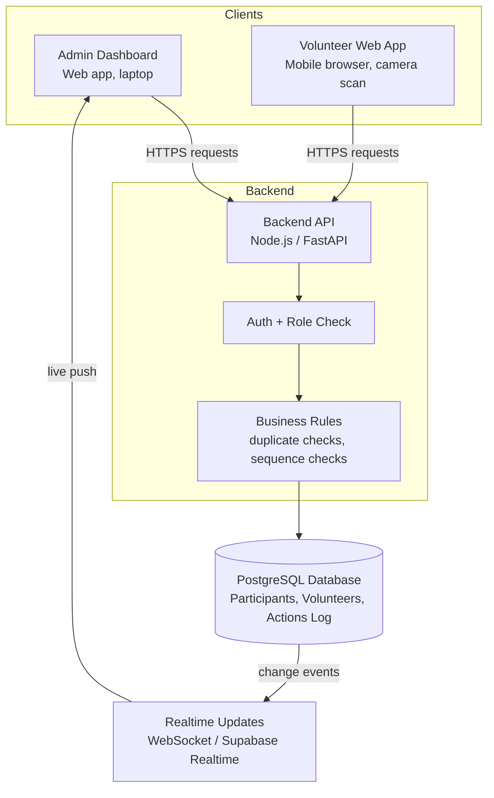
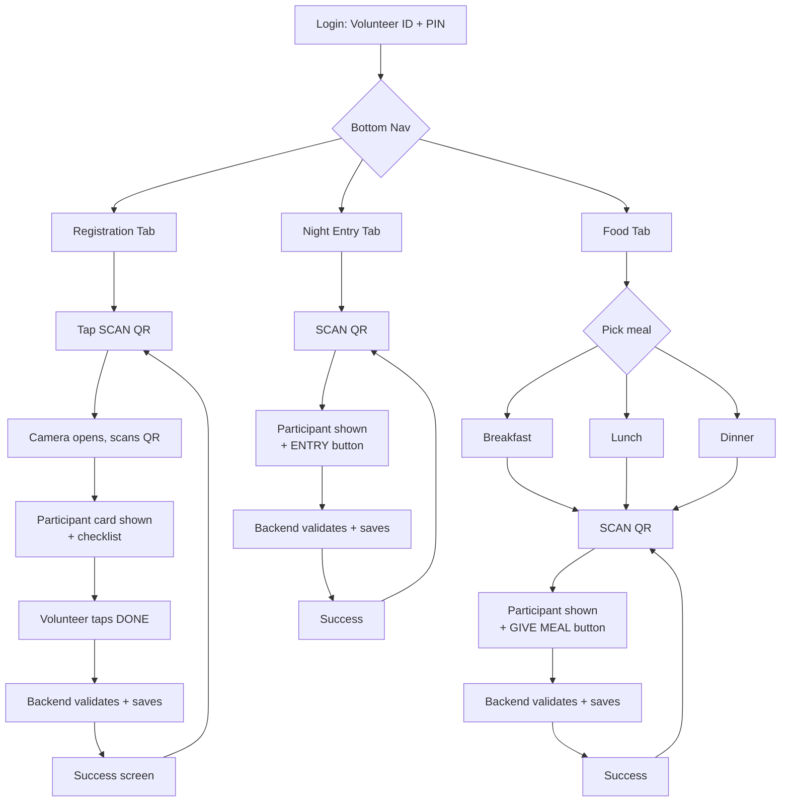
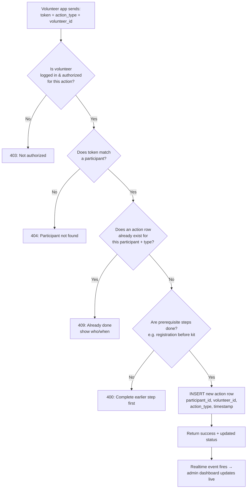
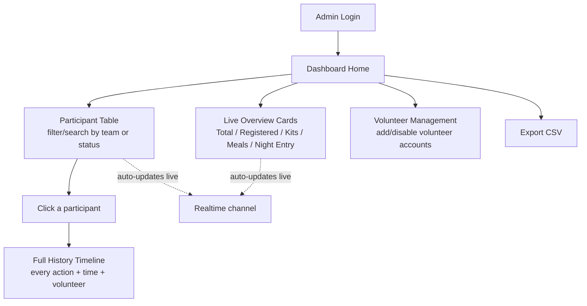
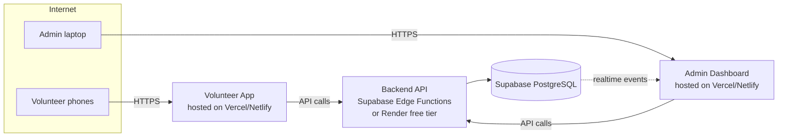

# Event QR Participant Management System — Architecture Document

**Scale target:** ~120 participants, ~30 volunteers, single overnight hackathon event
**Goal:** A simple, reliable system a student team can actually build and deploy — not an over-engineered one.

---

## 1. What We Are Actually Building (Plain Explanation)

Three pieces of software, all talking to **one shared backend and one shared database**:

1. **Volunteer App** — a phone-friendly web page (not a native app) that volunteers open in their phone's browser. It scans QR codes using the phone camera and lets the volunteer mark an action (registration, food, night entry).
2. **Admin Dashboard** — a website coordinators open on a laptop. Shows live counts, participant tables, and full history per participant.
3. **Backend API + Database** — the "brain." Every scan from every volunteer phone goes here. It decides if the action is allowed, records it, and pushes the update to the admin dashboard.

**Why one shared backend matters:** this is the whole point of the system. No app "remembers" anything on its own — the phone is just a scanner + button. The backend is the single source of truth, so two volunteers can never accidentally give the same person lunch twice.

At your scale (120 people, 30 volunteers), this is a genuinely small system. The hard technical problems (millions of rows, huge concurrent load) don't apply to you — the design below is intentionally light.

---

## 2. High-Level Architecture



**In words:** both apps are just "thin clients" — they show data and send requests. All the real decision-making (is this allowed? has it already happened?) lives in the backend, never in the app itself. This is the single most important design rule for this whole project.

---

## 3. What's On the QR Code

**Rule: the QR code contains almost nothing.** It is just a random lookup key, not participant data.

```
QR content  =  a random unique token string
Example:    =  "a91f3c9d-88e2-4a10-9b77-3c1e9a0e2d4f"
```

**Why not just print the Participant ID (EVT-00125) in the QR?**
It's simpler, but anyone could guess or recreate IDs sequentially (EVT-00001, EVT-00002...) and print a fake card. A long random token is hard to guess and costs nothing extra to implement.

Flow every time a QR is scanned:

```
Scanned text (token)
      ↓
Sent to backend: POST /scan { token }
      ↓
Backend looks up participant by token
      ↓
Backend returns: name, team, college, current status
      ↓
App displays participant + relevant action buttons
```

**At registration time**, you generate this token once per participant (e.g. with a UUID library), save it in the database next to that participant's row, and print it as a QR on their ID card. That's it — no signing, no encryption needed at this scale. A long random UUID is already effectively unguessable.

---

## 4. Database Schema (Simple, Action-Log Based)

You had the right instinct in your notes: **don't just store `lunch = true/false`. Store a log of events.** Booleans lose "when" and "who." A log gives you both, and the booleans/status you need for the UI can be *derived* from the log.

```mermaid
erDiagram
    TEAMS ||--o{ PARTICIPANTS : has
    PARTICIPANTS ||--o{ ACTIONS : "has history of"
    VOLUNTEERS ||--o{ ACTIONS : performs

    TEAMS {
        int team_id PK
        string team_name
    }

    PARTICIPANTS {
        int participant_id PK
        string name
        string college
        int team_id FK
        string qr_token UNIQUE
        timestamp created_at
    }

    VOLUNTEERS {
        int volunteer_id PK
        string username
        string password_hash
        string role
        string assigned_station
    }

    ACTIONS {
        int action_id PK
        int participant_id FK
        int volunteer_id FK
        string action_type
        timestamp created_at
    }
```

**`action_type` values (the full list you need):**
`ID_VERIFIED`, `REGISTRATION_COMPLETED`, `KIT_ISSUED`, `PAPER_SIGNED`, `BREAKFAST`, `LUNCH`, `DINNER`, `NIGHT_ENTRY`

**The one critical database rule (this solves duplicate-prevention AND concurrency in one line):**

```sql
CREATE UNIQUE INDEX one_action_per_participant
ON actions (participant_id, action_type);
```

This tells PostgreSQL itself: *"this participant can never have two `LUNCH` rows."* Even if two volunteers scan the same person at the exact same millisecond, the database will accept the first insert and reject the second automatically. You don't need to write clever locking code — the database does it for you for free. This is explained more in Section 8.

A participant's "status" (e.g., "Lunch: Given ✓") is simply: *does a `LUNCH` row exist for this participant?* You don't need a separate status table.

---

## 5. Volunteer App — Screens & Flow



**Design principle:** after every successful action, the screen should snap straight back to "ready to scan the next person" — minimum taps, no dead ends. This matters a lot in practice because volunteers will be doing this hundreds of times in a row.

---

## 6. Backend Flow — What Happens on Every Scan (Step by Step)

This is the same shape for registration, food, and night entry — only the `action_type` changes.



**Plain-English summary of the 6 backend checks from your notes**, mapped directly onto this diagram:
1. Participant exists → step B
2. QR valid → same as B (invalid token = no match)
3. Action already completed → step C
4. Volunteer authorized → step A
5. Previous steps completed → step D
6. Event currently active → an extra simple check: a single `event_settings` row with `is_active = true/false` that the admin can flip

---

## 7. Admin Dashboard — Screens & Flow



**How the live-updating actually works (in simple terms):** the admin dashboard doesn't repeatedly ask "anything new?" every second (that's wasteful). Instead, it opens one persistent connection to the backend. Whenever any volunteer's scan is saved to the database, the backend immediately pushes that one small update down that open connection, and the dashboard re-renders just that part of the screen — the count ticks up instantly without a manual refresh.

---

## 8. Duplicate Prevention & Concurrency — Explained Simply

**The scenario you're worried about:** two volunteers scan the same participant for lunch within the same second, both from an app that still shows "Lunch: Not Given."

**The wrong way to solve it:** check "has lunch been given?" and then, a moment later, insert the record. There's a tiny gap between the check and the insert — and in that gap, both requests can slip through. This is called a "race condition."

**The right way (and it's actually simpler to build):** let the database's unique constraint from Section 4 be the single source of truth. Both requests try to `INSERT`. The database physically only allows one row to exist for `(participant_id, 'LUNCH')`. The first insert succeeds. The second one is rejected by the database itself with an error — the backend catches that specific error and turns it into a clean "Lunch already given" message. You never need custom locking logic; you're just letting Postgres do what it's built to do.

At 120 participants and 30 volunteers, true simultaneous double-scans will be rare, but building it this way costs no extra effort and removes the entire problem permanently.

---

## 9. Roles & Permissions

| Action | Admin | Volunteer |
|---|---|---|
| Scan & record actions | ✅ (all types) | ✅ (only for their assigned tab/station) |
| View all participants | ✅ | ❌ (only the one they just scanned) |
| View full activity log / audit trail | ✅ | ❌ |
| Add/disable volunteer accounts | ✅ | ❌ |
| Override a duplicate action (correct a mistake) | ✅ | ❌ |
| Edit participant details | ✅ | ❌ |
| Delete any record | ❌ (avoid entirely, even for admin — see Section 14) | ❌ |
| Export data | ✅ | ❌ |

Practically: a volunteer's login token just carries `role: volunteer` and `station: food` (or similar). The backend checks this on **every** request — never trust the app screen to decide what a user is "allowed" to see, since the screen can be tampered with but the backend check cannot.

---

## 10. API Endpoints (What You'll Actually Build)

```
POST   /auth/login                 → returns a session token for admin or volunteer
POST   /scan                       → { token } → returns participant info + current status
POST   /actions                    → { participant_id, action_type } → records one action
GET    /participants               → admin only, full table
GET    /participants/:id/history   → full timeline for one participant
GET    /dashboard/summary          → live counts for the overview cards
GET    /volunteers                 → admin only
POST   /volunteers                 → admin only, create volunteer login
```

**Example: recording a lunch scan**

Request:
```json
POST /actions
{
  "participant_id": "EVT-00125",
  "action_type": "LUNCH"
}
```
(volunteer identity comes from their login session, not the request body — this stops a volunteer from claiming to be someone else)

Success response:
```json
{
  "status": "success",
  "action_type": "LUNCH",
  "recorded_at": "2026-09-18T13:04:52Z",
  "volunteer": "VOL-018"
}
```

Duplicate response:
```json
{
  "status": "error",
  "code": "ALREADY_DONE",
  "message": "Lunch has already been given.",
  "given_at": "2026-09-18T13:04:52Z",
  "given_by": "VOL-018"
}
```

---

## 11. Recommended Tech Stack (Sized for a Student Team, 120 People)

| Layer | Recommendation | Why |
|---|---|---|
| Volunteer app | **Mobile web app (PWA)**, not a native app | Skips app-store approval entirely. Any phone camera can scan via browser using a library like `html5-qrcode`. Just share a link. |
| Admin dashboard | React (or plain HTML/JS if the team is less experienced) | Small dataset, no need for anything heavy |
| Backend | Node.js + Express, **or** Python + FastAPI | Whichever your team already knows best — either is more than capable at this scale |
| Database | PostgreSQL | Matches your own notes; relational fits this data perfectly |
| Realtime updates | Built-in Postgres change feed via a managed provider (see Section 12), or plain polling every 5–10s as a fallback | At 120 participants, even simple polling works fine — don't over-invest here |
| Auth | Simple username+password with hashed passwords (bcrypt) and session tokens (JWT) | No need for anything more elaborate at this scale |

**Important MVP framing:** a native Android/iOS app is unnecessary complexity here — a mobile browser page with camera access does everything you need and ships in a fraction of the time.

---

## 12. Where to Host This for Free (Sized for 120 Participants / 30 Volunteers)

This scale is genuinely tiny by web standards, so every option below has a free tier that comfortably fits — the concern isn't "will it handle the load," it's "which is easiest for a student team to set up correctly." A recommended pairing:

| Piece | Free option | Notes |
|---|---|---|
| **Database + Backend logic** | **Supabase** (free tier) — hosted PostgreSQL, built-in auth, and built-in realtime updates | This single service can replace a hand-built backend for most of your endpoints, since it gives you a database, row-level auth rules, and live change events out of the box. Free tier easily covers a database this small. |
| **Custom backend logic** (the validation rules, e.g. "block duplicate lunch," "check sequence") | **Supabase Edge Functions**, or a small Node/FastAPI app on **Render** (free web service tier) or **Railway** (free trial credits) | Use this for anything more custom than Supabase's default database rules cover. |
| **Admin dashboard (website)** | **Vercel** or **Netlify** free tier | Both give free hosting + a live URL for a React/static site, with automatic deploys from GitHub. |
| **Volunteer app (mobile web)** | Same as above — **Vercel/Netlify** free tier | It's just another web page; no separate hosting needed. |
| **QR code generation** | Any open-source QR library (e.g. `qrcode` npm package) run locally when generating ID cards — no hosting needed | You generate these once before the event, not live. |

**Why this combo specifically:** Supabase alone gives you Postgres + Auth + Realtime for free, which covers roughly 60–70% of the "hard parts" of this project without you writing that infrastructure yourself. That's a large amount of saved effort for a student team on a deadline. Vercel/Netlify are the standard free choices for hosting the two websites.

One caution: free tiers on services like Render can "sleep" after inactivity and take a few seconds to wake up on the first request. For a live event, do a test scan right before doors open to "wake up" the backend, or choose Supabase Edge Functions (which don't have this cold-start sleep behavior) for anything scan-critical.

---

## 13. MVP vs. Later vs. Skip Entirely

| Feature | MVP (build first) | Add if time allows | Skip — unnecessary here |
|---|---|---|---|
| QR scan + participant lookup | ✅ | | |
| Registration checklist + backend validation | ✅ | | |
| Food (breakfast/lunch/dinner) with duplicate prevention | ✅ | | |
| Night entry tracking | ✅ | | |
| Admin overview counts | ✅ | | |
| Admin participant table + individual history | ✅ | | |
| Role-based login (admin vs volunteer) | ✅ | | |
| Live-updating dashboard (realtime push) | | ✅ (polling every 5–10s is a fine MVP substitute) | |
| CSV export | | ✅ | |
| Admin "override" for correcting mistaken duplicates | | ✅ | |
| Offline mode with later sync | | | ❌ — adds serious complexity (conflict resolution) for a single-venue, likely-WiFi-covered event |
| QR signing / cryptographic verification | | | ❌ — a long random token is already sufficient at this scale |
| Native mobile app | | | ❌ — mobile web page is strictly simpler and faster to ship |
| Microservices / multiple backend services | | | ❌ — one small backend service is all you need |
| Horizontal auto-scaling infrastructure | | | ❌ — 30 volunteers scanning is nowhere near a load concern |

---

## 14. Edge Cases Worth Planning For

- **Volunteer needs to undo a mistaken scan** (wrong person, fat-fingered button): don't allow `DELETE` on action rows even for admins — instead, add an `is_voided` flag admins can set, so the audit trail is never actually erased, just marked invalid.
- **QR code physically damaged/unreadable**: give volunteers a manual fallback — a small search-by-name/ID box for the rare case where a card won't scan.
- **Participant loses ID card**: admin panel should let an admin look up a participant and re-print/reissue the same QR token (don't generate a new one, or their history would split across two tokens).
- **Volunteer's phone loses signal mid-event**: show a clear "connection lost, please retry" message rather than a silent failure — don't let the app pretend an action succeeded when it didn't reach the backend.
- **Two people with visually similar names**: always confirm the Participant ID and photo (if you include one) on screen before letting the volunteer hit the action button, not just the name.
- **Event runs late / activity needed outside "normal" hours**: don't hardcode a time window — rely on the simple `is_active` flag mentioned in Section 6 instead.

---

## 15. Suggested Folder Structure

```
backend/
  src/
    routes/        (auth.js, scan.js, actions.js, dashboard.js, volunteers.js)
    controllers/    (business logic for each route)
    middleware/     (auth check, role check)
    db/             (connection + queries)
  package.json

admin-dashboard/
  src/
    pages/          (Login, Overview, ParticipantTable, ParticipantHistory, Volunteers)
    components/     (StatCard, Table, Timeline)
    api/            (calls to backend)

volunteer-app/
  src/
    pages/          (Login, Registration, Food, NightEntry)
    components/      (QRScanner, ParticipantCard, ActionButton)
    api/
```

---

## 16. Deployment Architecture (Putting It All Together)



---

## 17. Testing Strategy (Kept Realistic for a Student Team)

- **Before the event, with fake data:** create ~10 dummy participants, simulate the full journey (registration → kit → all meals → night entry) for each, and specifically try to double-scan the same action to confirm the duplicate-prevention actually blocks it.
- **Load check:** even a rough manual test — have 5–6 phones scan in quick succession — is enough at this scale; you don't need a formal load-testing tool.
- **Dry run night-before:** have real volunteers use the real app on real phones for a 15-minute rehearsal with a handful of test QR cards. This catches UI/scanning friction issues that are easy to miss testing alone.
- **Have a manual fallback ready:** a simple paper backup sheet for each station, just in case the network goes down entirely during the event — the system should reduce manual work, not become a single point of failure for the whole event.

---

## 18. One-Paragraph Summary

Every participant gets one QR code containing a random token. Volunteers use a simple mobile web page to scan it, which asks the backend "who is this and what's their status?" — the backend is the only place that knows the rules (don't double-give lunch, don't give a kit before registration), and it records every single action as its own timestamped, volunteer-attributed row rather than just flipping a `true/false`. The admin dashboard reads from that same live data and updates automatically. At 120 participants and 30 volunteers, this whole system comfortably fits on free hosting tiers (Supabase + Vercel/Netlify), and the biggest risk to avoid is over-building — a native app, offline sync, and cryptographic QR signing are all unnecessary complexity for an event this size.
