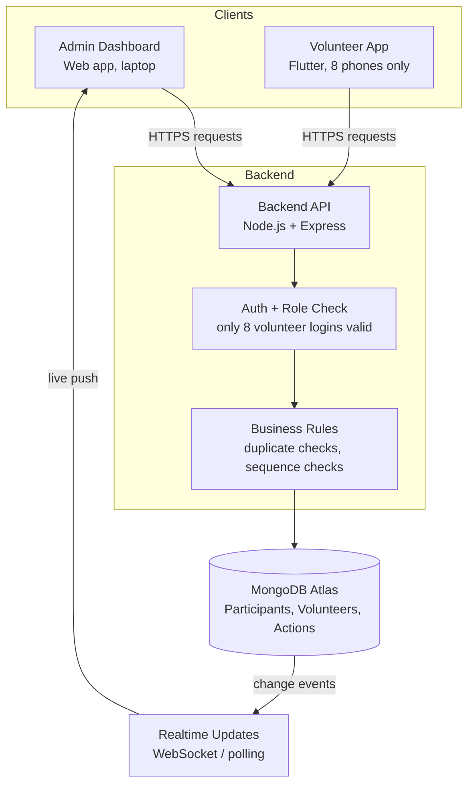
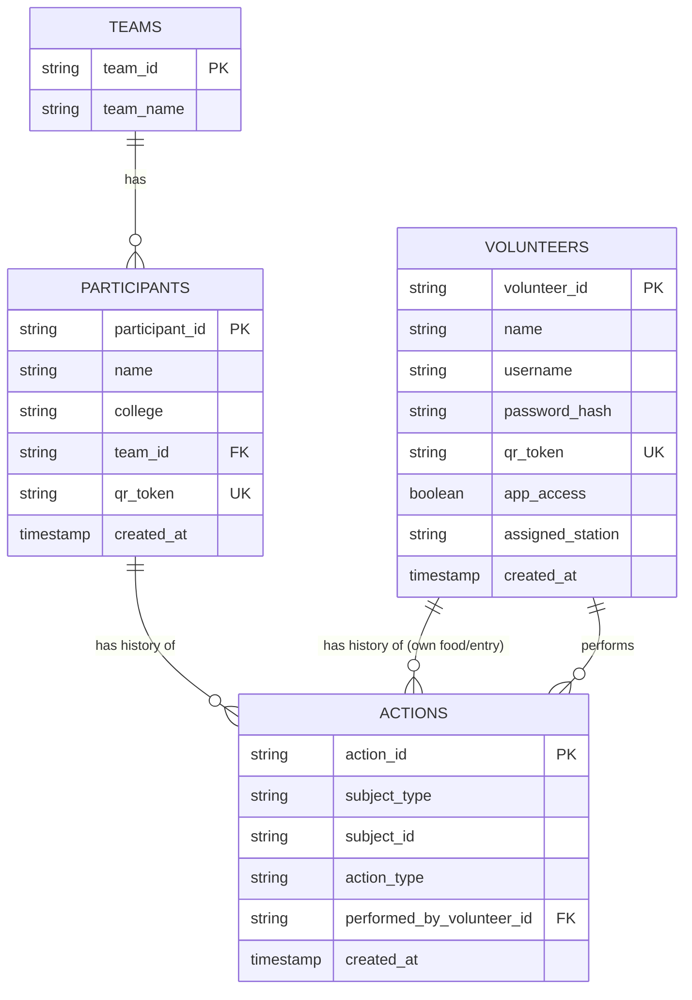
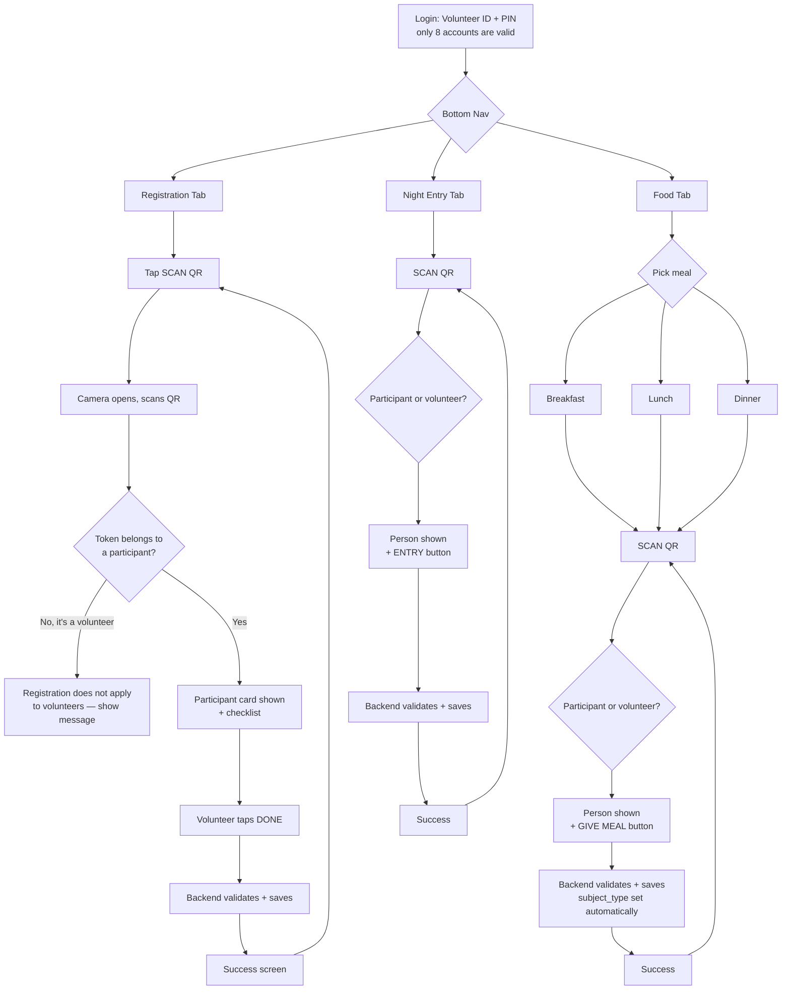
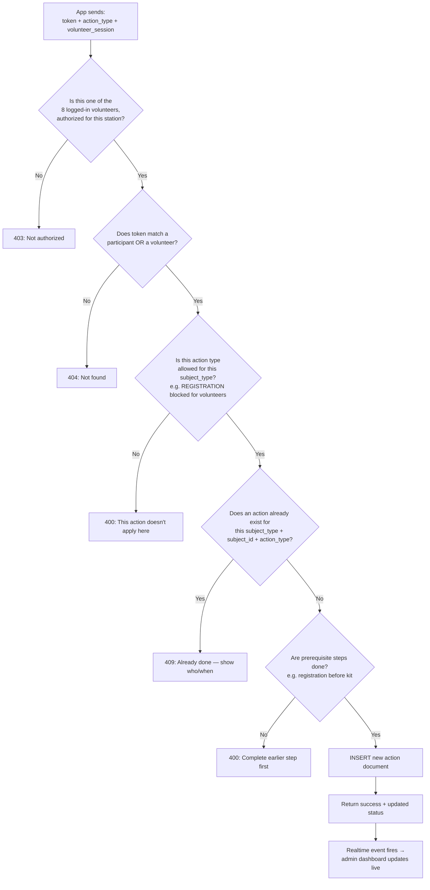
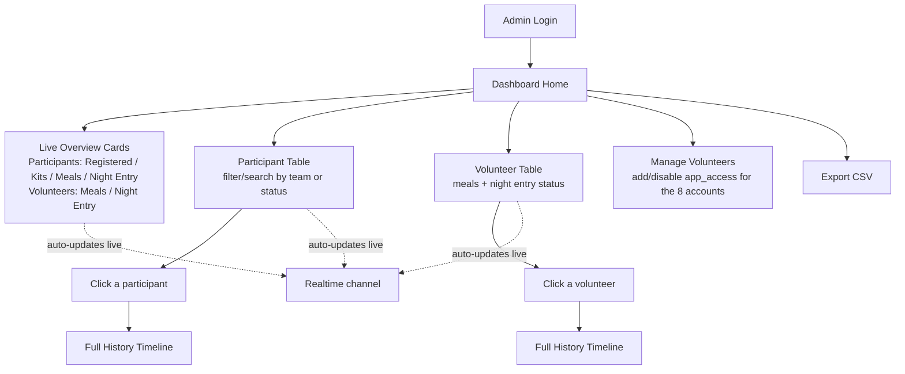
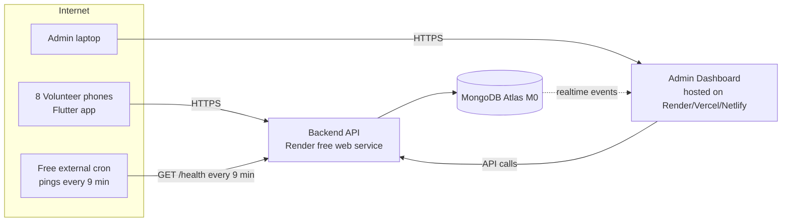

# Event QR Participant & Volunteer Management System — Architecture Document

**Scale target:** ~120 participants, volunteer team with **8 volunteers having scanning-app access**, single overnight hackathon event
**Final stack:** MongoDB Atlas (database) + Render (backend hosting) + Flutter (volunteer scanning app) + Web admin dashboard

> **Assumption used throughout this doc (please confirm):** Registration is for **participants only**. Food (breakfast/lunch/dinner) and Night Entry apply to **both participants and volunteers**, since volunteers are also fed and are also inside the venue overnight, and the admin needs a combined "has everyone eaten / has everyone entered" view. If this is wrong, say so and this gets a quick edit.

---

## 1. What We Are Actually Building (Plain Explanation)

Three pieces of software, all talking to **one shared backend and one shared MongoDB database**:

1. **Volunteer App (Flutter)** — a mobile app installed on the phones of the 8 volunteers who scan QR codes. Since it's only going to 8 known people, you don't need to publish it on the Play Store/App Store — build it, export the APK (Android) or an ad-hoc build (iOS), and share it directly (Drive link, WhatsApp, USB) with those 8 phones.
2. **Admin Dashboard (Web)** — a website coordinators open on a laptop. Shows live counts for participants *and* volunteers, full tables, and full history per person.
3. **Backend API + MongoDB** — the "brain." Every scan from every volunteer's Flutter app goes here. It decides if the action is allowed, records it, and pushes the update to the admin dashboard.

**Why one shared backend matters:** no app "remembers" anything on its own — the phone is just a scanner + button. The backend is the single source of truth, so two volunteers can never accidentally give the same person lunch twice, and no one can be double-counted for night entry.

---

## 2. High-Level Architecture



Both apps are "thin clients" — they show data and send requests. All real decision-making (is this allowed? has it already happened?) lives in the backend, never in the app itself.

---

## 3. What's On the QR Code

**Rule: the QR code contains almost nothing** — just a random lookup key.

```
QR content  =  a random unique token string
Example     =  "a91f3c9d-88e2-4a10-9b77-3c1e9a0e2d4f"
```

**Every person who can be scanned gets one token** — this now includes both participants (printed on their ID card) and volunteers (printed on their volunteer badge, since volunteers also get scanned for food and night entry).

Flow every time a QR is scanned:

```
Scanned text (token)
      ↓
Sent to backend: POST /scan { token }
      ↓
Backend looks up the token in BOTH participants and volunteers
      ↓
Backend returns: who they are, what type (participant/volunteer), current status
      ↓
App displays the person + the relevant action buttons for that screen
```

At registration/onboarding time, generate this token once per person (a UUID), save it on their document, and print it as a QR on their card/badge. No signing or encryption needed at this scale — a long random UUID is already effectively unguessable.

---

## 4. Database Design (MongoDB — Collections, Not Tables)

MongoDB is document-based, so instead of rigid tables we have **collections**. The same instinct from before still holds: **don't just store `lunch: true/false` on a person's document — store a log of timestamped, volunteer-attributed events**, and derive status from that log.

### Collections



**`participants` collection** — one document per participant:
```json
{
  "_id": "EVT-00125",
  "name": "Rahul Kumar",
  "college": "XYZ College",
  "team_id": "TEAM-ALPHA",
  "qr_token": "a91f3c9d-88e2-4a10-9b77-3c1e9a0e2d4f",
  "created_at": "2026-09-18T06:00:00Z"
}
```

**`volunteers` collection** — one document per volunteer. `app_access` marks exactly which volunteers can log into the Flutter app (your "only 8" rule) — this lets you add more volunteers to the system later (for meal tracking etc.) without automatically giving them scanner-app logins:
```json
{
  "_id": "VOL-018",
  "name": "Aisha Verma",
  "username": "vol018",
  "password_hash": "•••••",
  "qr_token": "5e2a11f0-...",
  "app_access": true,
  "assigned_station": "food",
  "created_at": "2026-09-18T06:00:00Z"
}
```

**`actions` collection** — the single event log, shared by participants and volunteers, using `subject_type` to tell them apart:
```json
{
  "_id": "ACT-004821",
  "subject_type": "participant",
  "subject_id": "EVT-00125",
  "action_type": "LUNCH",
  "performed_by_volunteer_id": "VOL-018",
  "created_at": "2026-09-18T13:04:52Z"
}
```
```json
{
  "_id": "ACT-004822",
  "subject_type": "volunteer",
  "subject_id": "VOL-022",
  "action_type": "LUNCH",
  "performed_by_volunteer_id": "VOL-018",
  "created_at": "2026-09-18T13:11:09Z"
}
```

**`action_type` values, and who they apply to:**

| action_type | Applies to |
|---|---|
| `ID_VERIFIED` | Participants only |
| `REGISTRATION_COMPLETED` | Participants only |
| `KIT_ISSUED` | Participants only |
| `PAPER_SIGNED` | Participants only |
| `BREAKFAST` / `LUNCH` / `DINNER` | Participants **and** volunteers |
| `NIGHT_ENTRY` | Participants **and** volunteers |

### The one critical rule that prevents duplicates (MongoDB version)

```js
db.actions.createIndex(
  { subject_type: 1, subject_id: 1, action_type: 1 },
  { unique: true }
)
```

This tells MongoDB: *"this exact subject (participant OR volunteer) can never have two `LUNCH` rows."* If two volunteers scan the same person for lunch at the same moment, MongoDB accepts the first insert and rejects the second with an `E11000 duplicate key` error — your backend catches that specific error and turns it into a clean "Lunch already given" message. No manual locking code needed.

A person's status (e.g. "Lunch: Given ✓") is simply: *does an action document exist for `(subject_type, subject_id, 'LUNCH')`?* You don't need a separate status field to keep in sync.

---

## 5. How Data Storage Size Actually Looks (MongoDB Atlas Free Tier)

| Collection | Docs | Rough size each | Total |
|---|---|---|---|
| participants | 120 | ~0.5 KB | ~60 KB |
| volunteers | ~10–30 | ~0.3 KB | ~10 KB |
| teams | ~20 | ~0.2 KB | ~4 KB |
| actions | up to (120+8) × ~7 actions ≈ 900 | ~0.3 KB | ~270 KB |

**Total real data: well under 1 MB**, even generously padded for indexes it stays in the low single-digit MB. Your MongoDB Atlas **free M0 tier (512 MB)** is 100x+ more than you will ever need — it is not something to worry about for this event.

---

## 6. Volunteer App (Flutter) — Screens & Flow



Notice the Registration tab is the one exception that explicitly rejects volunteer QR codes — that's the one workflow that's participant-only per Section 4's table.

**Login for the app:** since only 8 volunteers ever use it, keep this dead simple — a `volunteer_id` + PIN login screen, and the backend only issues a valid session if that volunteer's document has `app_access: true`.

---

## 7. Backend Flow — What Happens on Every Scan

Same shape for every tab; only `action_type` and which collection is checked (`subject_type`) changes.



---

## 8. Admin Dashboard — Screens & Flow



**Combined "has everyone eaten" view:** the overview cards show participants and volunteers as two related-but-separate counts (e.g. "Lunch — Participants: 98/120, Volunteers: 7/8") so the admin can see the full picture without the two groups' numbers blending together confusingly.

**How live-updating works:** the dashboard opens one persistent connection to the backend. Whenever any scan is saved, the backend pushes that one small update down the open connection and the dashboard re-renders just that part — no manual refresh needed.

---

## 9. Duplicate Prevention & Concurrency — Explained Simply

**The scenario:** two volunteers scan the same person for lunch within the same second.

**The wrong way:** check "already given?" then insert a moment later — there's a small gap where both requests can slip through (a "race condition").

**The right way:** let MongoDB's unique index (Section 4) be the single source of truth. Both requests try to insert. MongoDB physically allows only one document for `(subject_type, subject_id, action_type)`. The first insert succeeds; the second is rejected by the database itself, and the backend turns that rejection into a clean "already given" message. No custom locking code required.

---

## 10. Roles & Permissions

| Action | Admin | Volunteer (1 of the 8) |
|---|---|---|
| Scan & record actions | ✅ (all types) | ✅ (only for their assigned tab/station) |
| View all participants/volunteers | ✅ | ❌ (only the one they just scanned) |
| View full activity log / audit trail | ✅ | ❌ |
| Add/disable volunteer app access | ✅ | ❌ |
| Override a duplicate action (fix a mistake) | ✅ | ❌ |
| Edit participant/volunteer details | ✅ | ❌ |
| Delete any record | ❌ (avoid entirely — see Section 15) | ❌ |
| Export data | ✅ | ❌ |

A volunteer's login session carries `role: volunteer`, `volunteer_id`, and `station`. The backend checks this on **every** request — never trust the app screen alone, since a screen can be tampered with but a backend check cannot.

---

## 11. API Endpoints

```
POST   /auth/login                    → returns a session token (admin or one of the 8 volunteers)
POST   /scan                          → { token } → returns subject_type + person info + current status
POST   /actions                       → { subject_type, subject_id, action_type } → records one action
GET    /participants                  → admin only, full table
GET    /volunteers                    → admin only, full table
GET    /participants/:id/history      → full timeline for one participant
GET    /volunteers/:id/history        → full timeline for one volunteer
GET    /dashboard/summary             → live counts (participants + volunteers, separated)
POST   /volunteers                    → admin only, create a volunteer (app_access true/false)
```

**Example: recording a volunteer's own lunch**

Request:
```json
POST /actions
{
  "subject_type": "volunteer",
  "subject_id": "VOL-022",
  "action_type": "LUNCH"
}
```
(the scanning volunteer's own identity comes from their login session, not the request body)

Success response:
```json
{
  "status": "success",
  "subject_type": "volunteer",
  "action_type": "LUNCH",
  "recorded_at": "2026-09-18T13:11:09Z",
  "performed_by": "VOL-018"
}
```

Duplicate response:
```json
{
  "status": "error",
  "code": "ALREADY_DONE",
  "message": "Lunch has already been given.",
  "given_at": "2026-09-18T13:11:09Z",
  "given_by": "VOL-018"
}
```

Wrong-action-type response (e.g. trying REGISTRATION on a volunteer):
```json
{
  "status": "error",
  "code": "ACTION_NOT_APPLICABLE",
  "message": "Registration does not apply to volunteers."
}
```

---

## 12. Final Tech Stack

| Layer | Choice | Why |
|---|---|---|
| Volunteer app | **Flutter** (Android build shared as an APK directly to the 8 phones) | You've chosen this — since distribution is to only 8 known people, you can skip the Play Store entirely and just share the APK file |
| Admin dashboard | React (or plain HTML/JS) | Small dataset, no need for anything heavy |
| Backend | **Node.js + Express** (Mongoose for MongoDB) — FastAPI + PyMongo/Motor is an equally fine alternative if your team knows Python better | Simple REST API, pairs cleanly with MongoDB |
| Database | **MongoDB Atlas (M0 free tier)** | Finalized — see Section 5 for why 512 MB is plenty |
| Auth | Username+PIN with hashed passwords (bcrypt) and session tokens (JWT) | No need for anything more elaborate at this scale |
| Realtime updates | WebSocket (Socket.IO) for the admin dashboard, or polling every 5–10s as a simpler fallback | Either is fine at this scale |

---

## 13. Hosting: Render + Your Keep-Alive Script

**Finalized choice: Render free web service** for the backend.

Render's free tier sleeps a service after **15 minutes** of no incoming traffic, and the first request after sleeping takes 30–60 seconds to wake up. Your plan — a script that pings the backend's URL every **9 minutes** — is the right fix, and 9 minutes is safely under the 15-minute threshold with margin for network delays.

**How to build the keep-alive script (two options):**
- **Simple/free and reliable:** use a free external cron service like [cron-job.org](https://cron-job.org) or UptimeRobot to hit a lightweight `GET /health` endpoint on your backend every 9 minutes. This is more reliable than self-pinging because it runs outside Render, so it isn't affected by your own service sleeping.
- **Self-pinging (inside your own backend):** a `setInterval` or `node-cron` job inside the Express app that calls its own `/health` route every 9 minutes. Simpler to set up, but has a chicken-and-egg risk if the service ever cold-starts from something outside your control (a deploy, a crash) — the external cron option avoids that.

**One number worth knowing:** Render's free tier gives **750 instance-hours/month**, and a 31-day month has 744 hours. Keeping the service awake 24/7 all month fits *just* inside that limit — but it's tight. If you only need it awake during your active dev/testing days and the event itself (not the full month), turn the keep-alive off outside those windows so you have hours to spare rather than running right at the edge.

Add a simple `/health` endpoint that just returns `{ status: "ok" }` — this is what the keep-alive pings hit, and it avoids putting load on your real database-touching endpoints just to stay awake.

---

## 14. MVP vs. Later vs. Skip Entirely

| Feature | MVP (build first) | Add if time allows | Skip — unnecessary here |
|---|---|---|---|
| QR scan + participant/volunteer lookup | ✅ | | |
| Registration checklist (participants only) + backend validation | ✅ | | |
| Food (breakfast/lunch/dinner) for participants **and** volunteers, duplicate-proof | ✅ | | |
| Night entry for participants **and** volunteers | ✅ | | |
| Admin overview counts, split by participant/volunteer | ✅ | | |
| Admin tables + individual history | ✅ | | |
| Role-based login (admin vs. 8 volunteer accounts) | ✅ | | |
| Render keep-alive script | ✅ | | |
| Live-updating dashboard (realtime push) | | ✅ (5–10s polling is a fine MVP substitute) | |
| CSV export | | ✅ | |
| Admin "override" for correcting mistaken duplicates | | ✅ | |
| Offline mode with later sync | | | ❌ — adds real complexity for a single-venue event |
| QR signing / cryptographic verification | | | ❌ — random UUID token is sufficient here |
| Publishing the Flutter app to Play Store | | | ❌ — unnecessary for 8 known phones, just share the APK |
| Microservices | | | ❌ — one backend service is all you need |

---

## 15. Edge Cases Worth Planning For

- **Volunteer needs to undo a mistaken scan:** don't allow `DELETE` on action documents even for admins — add an `is_voided` flag instead, so the audit trail is never erased, only marked invalid.
- **QR code damaged/unreadable:** give volunteers a manual fallback — a search-by-name/ID box in the app for when a card won't scan.
- **Volunteer's own badge is lost:** admin should be able to look up that volunteer and reissue their existing token (don't generate a new one, or their history splits across two tokens).
- **A volunteer without `app_access` accidentally tries to log in:** backend should reject clearly ("this account does not have scanner access") rather than silently failing.
- **Phone loses signal mid-event:** show a clear "connection lost, please retry" message — never let the app pretend an action succeeded when it didn't reach the backend.
- **Registration accidentally attempted on a volunteer's badge:** backend rejects it with the `ACTION_NOT_APPLICABLE` response from Section 11 — this needs to be one of your very first tests.
- **Render cold start right as the event starts:** send a manual warm-up ping ~10 minutes before doors open, even with the 9-minute keep-alive running, as a safety margin.

---

## 16. Suggested Folder Structure

```
backend/
  src/
    routes/         (auth.js, scan.js, actions.js, dashboard.js, volunteers.js, health.js)
    controllers/     (business logic for each route)
    middleware/      (auth check, role check, subject-type/action-type validity check)
    models/          (Mongoose schemas: Participant, Volunteer, Action, Team)
    db/              (MongoDB connection)
  package.json

admin-dashboard/
  src/
    pages/           (Login, Overview, ParticipantTable, VolunteerTable, History, ManageVolunteers)
    components/       (StatCard, Table, Timeline)
    api/              (calls to backend)

volunteer-app-flutter/
  lib/
    screens/          (login_screen.dart, registration_screen.dart, food_screen.dart, night_entry_screen.dart)
    widgets/           (qr_scanner.dart, person_card.dart, action_button.dart)
    services/          (api_service.dart)
```

---

## 17. Deployment Architecture



---

## 18. Testing Strategy

- **Before the event, with fake data:** create ~10 dummy participants and 2–3 dummy volunteers, simulate the full journey for each, and specifically try to double-scan the same action to confirm the duplicate index actually blocks it.
- **Test the participant/volunteer split explicitly:** try scanning a volunteer's QR on the Registration tab and confirm you get the "doesn't apply" error, not a crash.
- **Test the 8-account limit:** try logging in with a volunteer account that has `app_access: false` and confirm it's rejected.
- **Keep-alive check:** leave the backend idle for 20+ minutes and confirm the cron ping is actually preventing the sleep (check Render's logs).
- **Dry run night-before:** real volunteers, real phones, real Flutter app, a handful of test QR badges for 15 minutes — this catches UI/scanning friction you won't find testing alone.
- **Manual fallback ready:** a simple paper backup sheet per station in case the network goes down entirely during the event.

---

## 19. One-Paragraph Summary

Every participant and every one of the 8 app-enabled volunteers gets a QR code with a random token. The Flutter app scans it and asks the backend "who is this, and what's their status?" — the backend is the only place that knows the rules (registration is participant-only; food and night entry apply to both participants and volunteers; nothing can be recorded twice), and it stores every action as its own timestamped, volunteer-attributed MongoDB document rather than a simple true/false flag. The admin web dashboard reads that same live data and updates automatically, showing participants and volunteers as clearly separated but simultaneously visible counts. The whole system runs on MongoDB Atlas's free tier (which is drastically oversized for this data) and Render's free tier (kept awake by your 9-minute keep-alive ping), with zero App Store/Play Store overhead since the Flutter app only ever needs to reach 8 phones.
# Event QR Participant & Volunteer Management System — Architecture Document

**Scale target:** ~120 participants, volunteer team with **8 volunteers having scanning-app access**, single overnight hackathon event
**Final stack:** MongoDB Atlas (database) + Render (backend hosting) + Flutter (volunteer scanning app) + Web admin dashboard

> **Assumption used throughout this doc (please confirm):** Registration is for **participants only**. Food (breakfast/lunch/dinner) and Night Entry apply to **both participants and volunteers**, since volunteers are also fed and are also inside the venue overnight, and the admin needs a combined "has everyone eaten / has everyone entered" view. If this is wrong, say so and this gets a quick edit.

---

## 1. What We Are Actually Building (Plain Explanation)

Three pieces of software, all talking to **one shared backend and one shared MongoDB database**:

1. **Volunteer App (Flutter)** — a mobile app installed on the phones of the 8 volunteers who scan QR codes. Since it's only going to 8 known people, you don't need to publish it on the Play Store/App Store — build it, export the APK (Android) or an ad-hoc build (iOS), and share it directly (Drive link, WhatsApp, USB) with those 8 phones.
2. **Admin Dashboard (Web)** — a website coordinators open on a laptop. Shows live counts for participants *and* volunteers, full tables, and full history per person.
3. **Backend API + MongoDB** — the "brain." Every scan from every volunteer's Flutter app goes here. It decides if the action is allowed, records it, and pushes the update to the admin dashboard.

**Why one shared backend matters:** no app "remembers" anything on its own — the phone is just a scanner + button. The backend is the single source of truth, so two volunteers can never accidentally give the same person lunch twice, and no one can be double-counted for night entry.

---

## 2. High-Level Architecture


Both apps are "thin clients" — they show data and send requests. All real decision-making (is this allowed? has it already happened?) lives in the backend, never in the app itself.

---

## 3. What's On the QR Code

**Rule: the QR code contains almost nothing** — just a random lookup key.

```
QR content  =  a random unique token string
Example     =  "a91f3c9d-88e2-4a10-9b77-3c1e9a0e2d4f"
```

**Every person who can be scanned gets one token** — this now includes both participants (printed on their ID card) and volunteers (printed on their volunteer badge, since volunteers also get scanned for food and night entry).

Flow every time a QR is scanned:

```
Scanned text (token)
      ↓
Sent to backend: POST /scan { token }
      ↓
Backend looks up the token in BOTH participants and volunteers
      ↓
Backend returns: who they are, what type (participant/volunteer), current status
      ↓
App displays the person + the relevant action buttons for that screen
```

At registration/onboarding time, generate this token once per person (a UUID), save it on their document, and print it as a QR on their card/badge. No signing or encryption needed at this scale — a long random UUID is already effectively unguessable.

---

## 4. Database Design (MongoDB — Collections, Not Tables)

MongoDB is document-based, so instead of rigid tables we have **collections**. The same instinct from before still holds: **don't just store `lunch: true/false` on a person's document — store a log of timestamped, volunteer-attributed events**, and derive status from that log.

### Collections


**`participants` collection** — one document per participant:
```json
{
  "_id": "EVT-00125",
  "name": "Rahul Kumar",
  "college": "XYZ College",
  "team_id": "TEAM-ALPHA",
  "qr_token": "a91f3c9d-88e2-4a10-9b77-3c1e9a0e2d4f",
  "created_at": "2026-09-18T06:00:00Z"
}
```

**`volunteers` collection** — one document per volunteer. `app_access` marks exactly which volunteers can log into the Flutter app (your "only 8" rule) — this lets you add more volunteers to the system later (for meal tracking etc.) without automatically giving them scanner-app logins:
```json
{
  "_id": "VOL-018",
  "name": "Aisha Verma",
  "username": "vol018",
  "password_hash": "•••••",
  "qr_token": "5e2a11f0-...",
  "app_access": true,
  "assigned_station": "food",
  "created_at": "2026-09-18T06:00:00Z"
}
```

**`actions` collection** — the single event log, shared by participants and volunteers, using `subject_type` to tell them apart:
```json
{
  "_id": "ACT-004821",
  "subject_type": "participant",
  "subject_id": "EVT-00125",
  "action_type": "LUNCH",
  "performed_by_volunteer_id": "VOL-018",
  "created_at": "2026-09-18T13:04:52Z"
}
```
```json
{
  "_id": "ACT-004822",
  "subject_type": "volunteer",
  "subject_id": "VOL-022",
  "action_type": "LUNCH",
  "performed_by_volunteer_id": "VOL-018",
  "created_at": "2026-09-18T13:11:09Z"
}
```

**`action_type` values, and who they apply to:**

| action_type | Applies to |
|---|---|
| `ID_VERIFIED` | Participants only |
| `REGISTRATION_COMPLETED` | Participants only |
| `KIT_ISSUED` | Participants only |
| `PAPER_SIGNED` | Participants only |
| `BREAKFAST` / `LUNCH` / `DINNER` | Participants **and** volunteers |
| `NIGHT_ENTRY` | Participants **and** volunteers |

### The one critical rule that prevents duplicates (MongoDB version)

```js
db.actions.createIndex(
  { subject_type: 1, subject_id: 1, action_type: 1 },
  { unique: true }
)
```

This tells MongoDB: *"this exact subject (participant OR volunteer) can never have two `LUNCH` rows."* If two volunteers scan the same person for lunch at the same moment, MongoDB accepts the first insert and rejects the second with an `E11000 duplicate key` error — your backend catches that specific error and turns it into a clean "Lunch already given" message. No manual locking code needed.

A person's status (e.g. "Lunch: Given ✓") is simply: *does an action document exist for `(subject_type, subject_id, 'LUNCH')`?* You don't need a separate status field to keep in sync.

---

## 5. How Data Storage Size Actually Looks (MongoDB Atlas Free Tier)

| Collection | Docs | Rough size each | Total |
|---|---|---|---|
| participants | 120 | ~0.5 KB | ~60 KB |
| volunteers | ~10–30 | ~0.3 KB | ~10 KB |
| teams | ~20 | ~0.2 KB | ~4 KB |
| actions | up to (120+8) × ~7 actions ≈ 900 | ~0.3 KB | ~270 KB |

**Total real data: well under 1 MB**, even generously padded for indexes it stays in the low single-digit MB. Your MongoDB Atlas **free M0 tier (512 MB)** is 100x+ more than you will ever need — it is not something to worry about for this event.

---

## 6. Volunteer App (Flutter) — Screens & Flow


Notice the Registration tab is the one exception that explicitly rejects volunteer QR codes — that's the one workflow that's participant-only per Section 4's table.

**Login for the app:** since only 8 volunteers ever use it, keep this dead simple — a `volunteer_id` + PIN login screen, and the backend only issues a valid session if that volunteer's document has `app_access: true`.

---

## 7. Backend Flow — What Happens on Every Scan

Same shape for every tab; only `action_type` and which collection is checked (`subject_type`) changes.


---

## 8. Admin Dashboard — Screens & Flow


**Combined "has everyone eaten" view:** the overview cards show participants and volunteers as two related-but-separate counts (e.g. "Lunch — Participants: 98/120, Volunteers: 7/8") so the admin can see the full picture without the two groups' numbers blending together confusingly.

**How live-updating works:** the dashboard opens one persistent connection to the backend. Whenever any scan is saved, the backend pushes that one small update down the open connection and the dashboard re-renders just that part — no manual refresh needed.

---

## 9. Duplicate Prevention & Concurrency — Explained Simply

**The scenario:** two volunteers scan the same person for lunch within the same second.

**The wrong way:** check "already given?" then insert a moment later — there's a small gap where both requests can slip through (a "race condition").

**The right way:** let MongoDB's unique index (Section 4) be the single source of truth. Both requests try to insert. MongoDB physically allows only one document for `(subject_type, subject_id, action_type)`. The first insert succeeds; the second is rejected by the database itself, and the backend turns that rejection into a clean "already given" message. No custom locking code required.

---

## 10. Roles & Permissions

| Action | Admin | Volunteer (1 of the 8) |
|---|---|---|
| Scan & record actions | ✅ (all types) | ✅ (only for their assigned tab/station) |
| View all participants/volunteers | ✅ | ❌ (only the one they just scanned) |
| View full activity log / audit trail | ✅ | ❌ |
| Add/disable volunteer app access | ✅ | ❌ |
| Override a duplicate action (fix a mistake) | ✅ | ❌ |
| Edit participant/volunteer details | ✅ | ❌ |
| Delete any record | ❌ (avoid entirely — see Section 15) | ❌ |
| Export data | ✅ | ❌ |

A volunteer's login session carries `role: volunteer`, `volunteer_id`, and `station`. The backend checks this on **every** request — never trust the app screen alone, since a screen can be tampered with but a backend check cannot.

---

## 11. API Endpoints

```
POST   /auth/login                    → returns a session token (admin or one of the 8 volunteers)
POST   /scan                          → { token } → returns subject_type + person info + current status
POST   /actions                       → { subject_type, subject_id, action_type } → records one action
GET    /participants                  → admin only, full table
GET    /volunteers                    → admin only, full table
GET    /participants/:id/history      → full timeline for one participant
GET    /volunteers/:id/history        → full timeline for one volunteer
GET    /dashboard/summary             → live counts (participants + volunteers, separated)
POST   /volunteers                    → admin only, create a volunteer (app_access true/false)
```

**Example: recording a volunteer's own lunch**

Request:
```json
POST /actions
{
  "subject_type": "volunteer",
  "subject_id": "VOL-022",
  "action_type": "LUNCH"
}
```
(the scanning volunteer's own identity comes from their login session, not the request body)

Success response:
```json
{
  "status": "success",
  "subject_type": "volunteer",
  "action_type": "LUNCH",
  "recorded_at": "2026-09-18T13:11:09Z",
  "performed_by": "VOL-018"
}
```

Duplicate response:
```json
{
  "status": "error",
  "code": "ALREADY_DONE",
  "message": "Lunch has already been given.",
  "given_at": "2026-09-18T13:11:09Z",
  "given_by": "VOL-018"
}
```

Wrong-action-type response (e.g. trying REGISTRATION on a volunteer):
```json
{
  "status": "error",
  "code": "ACTION_NOT_APPLICABLE",
  "message": "Registration does not apply to volunteers."
}
```

---

## 12. Final Tech Stack

| Layer | Choice | Why |
|---|---|---|
| Volunteer app | **Flutter** (Android build shared as an APK directly to the 8 phones) | You've chosen this — since distribution is to only 8 known people, you can skip the Play Store entirely and just share the APK file |
| Admin dashboard | React (or plain HTML/JS) | Small dataset, no need for anything heavy |
| Backend | **Node.js + Express** (Mongoose for MongoDB) — FastAPI + PyMongo/Motor is an equally fine alternative if your team knows Python better | Simple REST API, pairs cleanly with MongoDB |
| Database | **MongoDB Atlas (M0 free tier)** | Finalized — see Section 5 for why 512 MB is plenty |
| Auth | Username+PIN with hashed passwords (bcrypt) and session tokens (JWT) | No need for anything more elaborate at this scale |
| Realtime updates | WebSocket (Socket.IO) for the admin dashboard, or polling every 5–10s as a simpler fallback | Either is fine at this scale |

---

## 13. Hosting: Render + Your Keep-Alive Script

**Finalized choice: Render free web service** for the backend.

Render's free tier sleeps a service after **15 minutes** of no incoming traffic, and the first request after sleeping takes 30–60 seconds to wake up. Your plan — a script that pings the backend's URL every **9 minutes** — is the right fix, and 9 minutes is safely under the 15-minute threshold with margin for network delays.

**How to build the keep-alive script (two options):**
- **Simple/free and reliable:** use a free external cron service like [cron-job.org](https://cron-job.org) or UptimeRobot to hit a lightweight `GET /health` endpoint on your backend every 9 minutes. This is more reliable than self-pinging because it runs outside Render, so it isn't affected by your own service sleeping.
- **Self-pinging (inside your own backend):** a `setInterval` or `node-cron` job inside the Express app that calls its own `/health` route every 9 minutes. Simpler to set up, but has a chicken-and-egg risk if the service ever cold-starts from something outside your control (a deploy, a crash) — the external cron option avoids that.

**One number worth knowing:** Render's free tier gives **750 instance-hours/month**, and a 31-day month has 744 hours. Keeping the service awake 24/7 all month fits *just* inside that limit — but it's tight. If you only need it awake during your active dev/testing days and the event itself (not the full month), turn the keep-alive off outside those windows so you have hours to spare rather than running right at the edge.

Add a simple `/health` endpoint that just returns `{ status: "ok" }` — this is what the keep-alive pings hit, and it avoids putting load on your real database-touching endpoints just to stay awake.

---

## 14. MVP vs. Later vs. Skip Entirely

| Feature | MVP (build first) | Add if time allows | Skip — unnecessary here |
|---|---|---|---|
| QR scan + participant/volunteer lookup | ✅ | | |
| Registration checklist (participants only) + backend validation | ✅ | | |
| Food (breakfast/lunch/dinner) for participants **and** volunteers, duplicate-proof | ✅ | | |
| Night entry for participants **and** volunteers | ✅ | | |
| Admin overview counts, split by participant/volunteer | ✅ | | |
| Admin tables + individual history | ✅ | | |
| Role-based login (admin vs. 8 volunteer accounts) | ✅ | | |
| Render keep-alive script | ✅ | | |
| Live-updating dashboard (realtime push) | | ✅ (5–10s polling is a fine MVP substitute) | |
| CSV export | | ✅ | |
| Admin "override" for correcting mistaken duplicates | | ✅ | |
| Offline mode with later sync | | | ❌ — adds real complexity for a single-venue event |
| QR signing / cryptographic verification | | | ❌ — random UUID token is sufficient here |
| Publishing the Flutter app to Play Store | | | ❌ — unnecessary for 8 known phones, just share the APK |
| Microservices | | | ❌ — one backend service is all you need |

---

## 15. Edge Cases Worth Planning For

- **Volunteer needs to undo a mistaken scan:** don't allow `DELETE` on action documents even for admins — add an `is_voided` flag instead, so the audit trail is never erased, only marked invalid.
- **QR code damaged/unreadable:** give volunteers a manual fallback — a search-by-name/ID box in the app for when a card won't scan.
- **Volunteer's own badge is lost:** admin should be able to look up that volunteer and reissue their existing token (don't generate a new one, or their history splits across two tokens).
- **A volunteer without `app_access` accidentally tries to log in:** backend should reject clearly ("this account does not have scanner access") rather than silently failing.
- **Phone loses signal mid-event:** show a clear "connection lost, please retry" message — never let the app pretend an action succeeded when it didn't reach the backend.
- **Registration accidentally attempted on a volunteer's badge:** backend rejects it with the `ACTION_NOT_APPLICABLE` response from Section 11 — this needs to be one of your very first tests.
- **Render cold start right as the event starts:** send a manual warm-up ping ~10 minutes before doors open, even with the 9-minute keep-alive running, as a safety margin.

---

## 16. Suggested Folder Structure

```
backend/
  src/
    routes/         (auth.js, scan.js, actions.js, dashboard.js, volunteers.js, health.js)
    controllers/     (business logic for each route)
    middleware/      (auth check, role check, subject-type/action-type validity check)
    models/          (Mongoose schemas: Participant, Volunteer, Action, Team)
    db/              (MongoDB connection)
  package.json

admin-dashboard/
  src/
    pages/           (Login, Overview, ParticipantTable, VolunteerTable, History, ManageVolunteers)
    components/       (StatCard, Table, Timeline)
    api/              (calls to backend)

volunteer-app-flutter/
  lib/
    screens/          (login_screen.dart, registration_screen.dart, food_screen.dart, night_entry_screen.dart)
    widgets/           (qr_scanner.dart, person_card.dart, action_button.dart)
    services/          (api_service.dart)
```

---

## 17. Deployment Architecture


---

## 18. Testing Strategy

- **Before the event, with fake data:** create ~10 dummy participants and 2–3 dummy volunteers, simulate the full journey for each, and specifically try to double-scan the same action to confirm the duplicate index actually blocks it.
- **Test the participant/volunteer split explicitly:** try scanning a volunteer's QR on the Registration tab and confirm you get the "doesn't apply" error, not a crash.
- **Test the 8-account limit:** try logging in with a volunteer account that has `app_access: false` and confirm it's rejected.
- **Keep-alive check:** leave the backend idle for 20+ minutes and confirm the cron ping is actually preventing the sleep (check Render's logs).
- **Dry run night-before:** real volunteers, real phones, real Flutter app, a handful of test QR badges for 15 minutes — this catches UI/scanning friction you won't find testing alone.
- **Manual fallback ready:** a simple paper backup sheet per station in case the network goes down entirely during the event.

---

## 19. One-Paragraph Summary

Every participant and every one of the 8 app-enabled volunteers gets a QR code with a random token. The Flutter app scans it and asks the backend "who is this, and what's their status?" — the backend is the only place that knows the rules (registration is participant-only; food and night entry apply to both participants and volunteers; nothing can be recorded twice), and it stores every action as its own timestamped, volunteer-attributed MongoDB document rather than a simple true/false flag. The admin web dashboard reads that same live data and updates automatically, showing participants and volunteers as clearly separated but simultaneously visible counts. The whole system runs on MongoDB Atlas's free tier (which is drastically oversized for this data) and Render's free tier (kept awake by your 9-minute keep-alive ping), with zero App Store/Play Store overhead since the Flutter app only ever needs to reach 8 phones.
        boolean app_access
        string assigned_station
        timestamp created_at
    }

    ACTIONS {
        string action_id PK
        string subject_type
        string subject_id
        string action_type
        string performed_by_volunteer_id FK
        timestamp created_at
    }
```

**`participants` collection** — one document per participant:
```json
{
  "_id": "EVT-00125",
  "name": "Rahul Kumar",
  "college": "XYZ College",
  "team_id": "TEAM-ALPHA",
  "qr_token": "a91f3c9d-88e2-4a10-9b77-3c1e9a0e2d4f",
  "created_at": "2026-09-18T06:00:00Z"
}
```

**`volunteers` collection** — one document per volunteer. `app_access` marks exactly which volunteers can log into the Flutter app (your "only 8" rule) — this lets you add more volunteers to the system later (for meal tracking etc.) without automatically giving them scanner-app logins:
```json
{
  "_id": "VOL-018",
  "name": "Aisha Verma",
  "username": "vol018",
  "password_hash": "•••••",
  "qr_token": "5e2a11f0-...",
  "app_access": true,
  "assigned_station": "food",
  "created_at": "2026-09-18T06:00:00Z"
}
```

**`actions` collection** — the single event log, shared by participants and volunteers, using `subject_type` to tell them apart:
```json
{
  "_id": "ACT-004821",
  "subject_type": "participant",
  "subject_id": "EVT-00125",
  "action_type": "LUNCH",
  "performed_by_volunteer_id": "VOL-018",
  "created_at": "2026-09-18T13:04:52Z"
}
```
```json
{
  "_id": "ACT-004822",
  "subject_type": "volunteer",
  "subject_id": "VOL-022",
  "action_type": "LUNCH",
  "performed_by_volunteer_id": "VOL-018",
  "created_at": "2026-09-18T13:11:09Z"
}
```

**`action_type` values, and who they apply to:**

| action_type | Applies to |
|---|---|
| `ID_VERIFIED` | Participants only |
| `REGISTRATION_COMPLETED` | Participants only |
| `KIT_ISSUED` | Participants only |
| `PAPER_SIGNED` | Participants only |
| `BREAKFAST` / `LUNCH` / `DINNER` | Participants **and** volunteers |
| `NIGHT_ENTRY` | Participants **and** volunteers |

### The one critical rule that prevents duplicates (MongoDB version)

```js
db.actions.createIndex(
  { subject_type: 1, subject_id: 1, action_type: 1 },
  { unique: true }
)
```

This tells MongoDB: *"this exact subject (participant OR volunteer) can never have two `LUNCH` rows."* If two volunteers scan the same person for lunch at the same moment, MongoDB accepts the first insert and rejects the second with an `E11000 duplicate key` error — your backend catches that specific error and turns it into a clean "Lunch already given" message. No manual locking code needed.

A person's status (e.g. "Lunch: Given ✓") is simply: *does an action document exist for `(subject_type, subject_id, 'LUNCH')`?* You don't need a separate status field to keep in sync.

---

## 5. How Data Storage Size Actually Looks (MongoDB Atlas Free Tier)

| Collection | Docs | Rough size each | Total |
|---|---|---|---|
| participants | 120 | ~0.5 KB | ~60 KB |
| volunteers | ~10–30 | ~0.3 KB | ~10 KB |
| teams | ~20 | ~0.2 KB | ~4 KB |
| actions | up to (120+8) × ~7 actions ≈ 900 | ~0.3 KB | ~270 KB |

**Total real data: well under 1 MB**, even generously padded for indexes it stays in the low single-digit MB. Your MongoDB Atlas **free M0 tier (512 MB)** is 100x+ more than you will ever need — it is not something to worry about for this event.

---

## 6. Volunteer App (Flutter) — Screens & Flow


Notice the Registration tab is the one exception that explicitly rejects volunteer QR codes — that's the one workflow that's participant-only per Section 4's table.

**Login for the app:** since only 8 volunteers ever use it, keep this dead simple — a `volunteer_id` + PIN login screen, and the backend only issues a valid session if that volunteer's document has `app_access: true`.

---

## 7. Backend Flow — What Happens on Every Scan

Same shape for every tab; only `action_type` and which collection is checked (`subject_type`) changes.


---

## 8. Admin Dashboard — Screens & Flow


**Combined "has everyone eaten" view:** the overview cards show participants and volunteers as two related-but-separate counts (e.g. "Lunch — Participants: 98/120, Volunteers: 7/8") so the admin can see the full picture without the two groups' numbers blending together confusingly.

**How live-updating works:** the dashboard opens one persistent connection to the backend. Whenever any scan is saved, the backend pushes that one small update down the open connection and the dashboard re-renders just that part — no manual refresh needed.

---

## 9. Duplicate Prevention & Concurrency — Explained Simply

**The scenario:** two volunteers scan the same person for lunch within the same second.

**The wrong way:** check "already given?" then insert a moment later — there's a small gap where both requests can slip through (a "race condition").

**The right way:** let MongoDB's unique index (Section 4) be the single source of truth. Both requests try to insert. MongoDB physically allows only one document for `(subject_type, subject_id, action_type)`. The first insert succeeds; the second is rejected by the database itself, and the backend turns that rejection into a clean "already given" message. No custom locking code required.

---

## 10. Roles & Permissions

| Action | Admin | Volunteer (1 of the 8) |
|---|---|---|
| Scan & record actions | ✅ (all types) | ✅ (only for their assigned tab/station) |
| View all participants/volunteers | ✅ | ❌ (only the one they just scanned) |
| View full activity log / audit trail | ✅ | ❌ |
| Add/disable volunteer app access | ✅ | ❌ |
| Override a duplicate action (fix a mistake) | ✅ | ❌ |
| Edit participant/volunteer details | ✅ | ❌ |
| Delete any record | ❌ (avoid entirely — see Section 15) | ❌ |
| Export data | ✅ | ❌ |

A volunteer's login session carries `role: volunteer`, `volunteer_id`, and `station`. The backend checks this on **every** request — never trust the app screen alone, since a screen can be tampered with but a backend check cannot.

---

## 11. API Endpoints

```
POST   /auth/login                    → returns a session token (admin or one of the 8 volunteers)
POST   /scan                          → { token } → returns subject_type + person info + current status
POST   /actions                       → { subject_type, subject_id, action_type } → records one action
GET    /participants                  → admin only, full table
GET    /volunteers                    → admin only, full table
GET    /participants/:id/history      → full timeline for one participant
GET    /volunteers/:id/history        → full timeline for one volunteer
GET    /dashboard/summary             → live counts (participants + volunteers, separated)
POST   /volunteers                    → admin only, create a volunteer (app_access true/false)
```

**Example: recording a volunteer's own lunch**

Request:
```json
POST /actions
{
  "subject_type": "volunteer",
  "subject_id": "VOL-022",
  "action_type": "LUNCH"
}
```
(the scanning volunteer's own identity comes from their login session, not the request body)

Success response:
```json
{
  "status": "success",
  "subject_type": "volunteer",
  "action_type": "LUNCH",
  "recorded_at": "2026-09-18T13:11:09Z",
  "performed_by": "VOL-018"
}
```

Duplicate response:
```json
{
  "status": "error",
  "code": "ALREADY_DONE",
  "message": "Lunch has already been given.",
  "given_at": "2026-09-18T13:11:09Z",
  "given_by": "VOL-018"
}
```

Wrong-action-type response (e.g. trying REGISTRATION on a volunteer):
```json
{
  "status": "error",
  "code": "ACTION_NOT_APPLICABLE",
  "message": "Registration does not apply to volunteers."
}
```

---

## 12. Final Tech Stack

| Layer | Choice | Why |
|---|---|---|
| Volunteer app | **Flutter** (Android build shared as an APK directly to the 8 phones) | You've chosen this — since distribution is to only 8 known people, you can skip the Play Store entirely and just share the APK file |
| Admin dashboard | React (or plain HTML/JS) | Small dataset, no need for anything heavy |
| Backend | **Node.js + Express** (Mongoose for MongoDB) — FastAPI + PyMongo/Motor is an equally fine alternative if your team knows Python better | Simple REST API, pairs cleanly with MongoDB |
| Database | **MongoDB Atlas (M0 free tier)** | Finalized — see Section 5 for why 512 MB is plenty |
| Auth | Username+PIN with hashed passwords (bcrypt) and session tokens (JWT) | No need for anything more elaborate at this scale |
| Realtime updates | WebSocket (Socket.IO) for the admin dashboard, or polling every 5–10s as a simpler fallback | Either is fine at this scale |

---

## 13. Hosting: Render + Your Keep-Alive Script

**Finalized choice: Render free web service** for the backend.

Render's free tier sleeps a service after **15 minutes** of no incoming traffic, and the first request after sleeping takes 30–60 seconds to wake up. Your plan — a script that pings the backend's URL every **9 minutes** — is the right fix, and 9 minutes is safely under the 15-minute threshold with margin for network delays.

**How to build the keep-alive script (two options):**
- **Simple/free and reliable:** use a free external cron service like [cron-job.org](https://cron-job.org) or UptimeRobot to hit a lightweight `GET /health` endpoint on your backend every 9 minutes. This is more reliable than self-pinging because it runs outside Render, so it isn't affected by your own service sleeping.
- **Self-pinging (inside your own backend):** a `setInterval` or `node-cron` job inside the Express app that calls its own `/health` route every 9 minutes. Simpler to set up, but has a chicken-and-egg risk if the service ever cold-starts from something outside your control (a deploy, a crash) — the external cron option avoids that.

**One number worth knowing:** Render's free tier gives **750 instance-hours/month**, and a 31-day month has 744 hours. Keeping the service awake 24/7 all month fits *just* inside that limit — but it's tight. If you only need it awake during your active dev/testing days and the event itself (not the full month), turn the keep-alive off outside those windows so you have hours to spare rather than running right at the edge.

Add a simple `/health` endpoint that just returns `{ status: "ok" }` — this is what the keep-alive pings hit, and it avoids putting load on your real database-touching endpoints just to stay awake.

---

## 14. MVP vs. Later vs. Skip Entirely

| Feature | MVP (build first) | Add if time allows | Skip — unnecessary here |
|---|---|---|---|
| QR scan + participant/volunteer lookup | ✅ | | |
| Registration checklist (participants only) + backend validation | ✅ | | |
| Food (breakfast/lunch/dinner) for participants **and** volunteers, duplicate-proof | ✅ | | |
| Night entry for participants **and** volunteers | ✅ | | |
| Admin overview counts, split by participant/volunteer | ✅ | | |
| Admin tables + individual history | ✅ | | |
| Role-based login (admin vs. 8 volunteer accounts) | ✅ | | |
| Render keep-alive script | ✅ | | |
| Live-updating dashboard (realtime push) | | ✅ (5–10s polling is a fine MVP substitute) | |
| CSV export | | ✅ | |
| Admin "override" for correcting mistaken duplicates | | ✅ | |
| Offline mode with later sync | | | ❌ — adds real complexity for a single-venue event |
| QR signing / cryptographic verification | | | ❌ — random UUID token is sufficient here |
| Publishing the Flutter app to Play Store | | | ❌ — unnecessary for 8 known phones, just share the APK |
| Microservices | | | ❌ — one backend service is all you need |

---

## 15. Edge Cases Worth Planning For

- **Volunteer needs to undo a mistaken scan:** don't allow `DELETE` on action documents even for admins — add an `is_voided` flag instead, so the audit trail is never erased, only marked invalid.
- **QR code damaged/unreadable:** give volunteers a manual fallback — a search-by-name/ID box in the app for when a card won't scan.
- **Volunteer's own badge is lost:** admin should be able to look up that volunteer and reissue their existing token (don't generate a new one, or their history splits across two tokens).
- **A volunteer without `app_access` accidentally tries to log in:** backend should reject clearly ("this account does not have scanner access") rather than silently failing.
- **Phone loses signal mid-event:** show a clear "connection lost, please retry" message — never let the app pretend an action succeeded when it didn't reach the backend.
- **Registration accidentally attempted on a volunteer's badge:** backend rejects it with the `ACTION_NOT_APPLICABLE` response from Section 11 — this needs to be one of your very first tests.
- **Render cold start right as the event starts:** send a manual warm-up ping ~10 minutes before doors open, even with the 9-minute keep-alive running, as a safety margin.

---

## 16. Suggested Folder Structure

```
backend/
  src/
    routes/         (auth.js, scan.js, actions.js, dashboard.js, volunteers.js, health.js)
    controllers/     (business logic for each route)
    middleware/      (auth check, role check, subject-type/action-type validity check)
    models/          (Mongoose schemas: Participant, Volunteer, Action, Team)
    db/              (MongoDB connection)
  package.json

admin-dashboard/
  src/
    pages/           (Login, Overview, ParticipantTable, VolunteerTable, History, ManageVolunteers)
    components/       (StatCard, Table, Timeline)
    api/              (calls to backend)

volunteer-app-flutter/
  lib/
    screens/          (login_screen.dart, registration_screen.dart, food_screen.dart, night_entry_screen.dart)
    widgets/           (qr_scanner.dart, person_card.dart, action_button.dart)
    services/          (api_service.dart)
```

---

## 17. Deployment Architecture


---

## 18. Testing Strategy

- **Before the event, with fake data:** create ~10 dummy participants and 2–3 dummy volunteers, simulate the full journey for each, and specifically try to double-scan the same action to confirm the duplicate index actually blocks it.
- **Test the participant/volunteer split explicitly:** try scanning a volunteer's QR on the Registration tab and confirm you get the "doesn't apply" error, not a crash.
- **Test the 8-account limit:** try logging in with a volunteer account that has `app_access: false` and confirm it's rejected.
- **Keep-alive check:** leave the backend idle for 20+ minutes and confirm the cron ping is actually preventing the sleep (check Render's logs).
- **Dry run night-before:** real volunteers, real phones, real Flutter app, a handful of test QR badges for 15 minutes — this catches UI/scanning friction you won't find testing alone.
- **Manual fallback ready:** a simple paper backup sheet per station in case the network goes down entirely during the event.

---

## 19. One-Paragraph Summary

Every participant and every one of the 8 app-enabled volunteers gets a QR code with a random token. The Flutter app scans it and asks the backend "who is this, and what's their status?" — the backend is the only place that knows the rules (registration is participant-only; food and night entry apply to both participants and volunteers; nothing can be recorded twice), and it stores every action as its own timestamped, volunteer-attributed MongoDB document rather than a simple true/false flag. The admin web dashboard reads that same live data and updates automatically, showing participants and volunteers as clearly separated but simultaneously visible counts. The whole system runs on MongoDB Atlas's free tier (which is drastically oversized for this data) and Render's free tier (kept awake by your 9-minute keep-alive ping), with zero App Store/Play Store overhead since the Flutter app only ever needs to reach 8 phones.
# Event QR Participant & Volunteer Management System — Architecture Document

**Scale target:** ~120 participants, volunteer team with **8 volunteers having scanning-app access**, single overnight hackathon event
**Final stack:** MongoDB Atlas (database) + Render (backend hosting) + Flutter (volunteer scanning app) + Web admin dashboard

> **Assumption used throughout this doc (please confirm):** Registration is for **participants only**. Food (breakfast/lunch/dinner) and Night Entry apply to **both participants and volunteers**, since volunteers are also fed and are also inside the venue overnight, and the admin needs a combined "has everyone eaten / has everyone entered" view. If this is wrong, say so and this gets a quick edit.

---

## 1. What We Are Actually Building (Plain Explanation)

Three pieces of software, all talking to **one shared backend and one shared MongoDB database**:

1. **Volunteer App (Flutter)** — a mobile app installed on the phones of the 8 volunteers who scan QR codes. Since it's only going to 8 known people, you don't need to publish it on the Play Store/App Store — build it, export the APK (Android) or an ad-hoc build (iOS), and share it directly (Drive link, WhatsApp, USB) with those 8 phones.
2. **Admin Dashboard (Web)** — a website coordinators open on a laptop. Shows live counts for participants *and* volunteers, full tables, and full history per person.
3. **Backend API + MongoDB** — the "brain." Every scan from every volunteer's Flutter app goes here. It decides if the action is allowed, records it, and pushes the update to the admin dashboard.

**Why one shared backend matters:** no app "remembers" anything on its own — the phone is just a scanner + button. The backend is the single source of truth, so two volunteers can never accidentally give the same person lunch twice, and no one can be double-counted for night entry.

---

## 2. High-Level Architecture


Both apps are "thin clients" — they show data and send requests. All real decision-making (is this allowed? has it already happened?) lives in the backend, never in the app itself.

---

## 3. What's On the QR Code

**Rule: the QR code contains almost nothing** — just a random lookup key.

```
QR content  =  a random unique token string
Example     =  "a91f3c9d-88e2-4a10-9b77-3c1e9a0e2d4f"
```

**Every person who can be scanned gets one token** — this now includes both participants (printed on their ID card) and volunteers (printed on their volunteer badge, since volunteers also get scanned for food and night entry).

Flow every time a QR is scanned:

```
Scanned text (token)
      ↓
Sent to backend: POST /scan { token }
      ↓
Backend looks up the token in BOTH participants and volunteers
      ↓
Backend returns: who they are, what type (participant/volunteer), current status
      ↓
App displays the person + the relevant action buttons for that screen
```

At registration/onboarding time, generate this token once per person (a UUID), save it on their document, and print it as a QR on their card/badge. No signing or encryption needed at this scale — a long random UUID is already effectively unguessable.

---

## 4. Database Design (MongoDB — Collections, Not Tables)

MongoDB is document-based, so instead of rigid tables we have **collections**. The same instinct from before still holds: **don't just store `lunch: true/false` on a person's document — store a log of timestamped, volunteer-attributed events**, and derive status from that log.

### Collections


**`participants` collection** — one document per participant:
```json
{
  "_id": "EVT-00125",
  "name": "Rahul Kumar",
  "college": "XYZ College",
  "team_id": "TEAM-ALPHA",
  "qr_token": "a91f3c9d-88e2-4a10-9b77-3c1e9a0e2d4f",
  "created_at": "2026-09-18T06:00:00Z"
}
```

**`volunteers` collection** — one document per volunteer. `app_access` marks exactly which volunteers can log into the Flutter app (your "only 8" rule) — this lets you add more volunteers to the system later (for meal tracking etc.) without automatically giving them scanner-app logins:
```json
{
  "_id": "VOL-018",
  "name": "Aisha Verma",
  "username": "vol018",
  "password_hash": "•••••",
  "qr_token": "5e2a11f0-...",
  "app_access": true,
  "assigned_station": "food",
  "created_at": "2026-09-18T06:00:00Z"
}
```

**`actions` collection** — the single event log, shared by participants and volunteers, using `subject_type` to tell them apart:
```json
{
  "_id": "ACT-004821",
  "subject_type": "participant",
  "subject_id": "EVT-00125",
  "action_type": "LUNCH",
  "performed_by_volunteer_id": "VOL-018",
  "created_at": "2026-09-18T13:04:52Z"
}
```
```json
{
  "_id": "ACT-004822",
  "subject_type": "volunteer",
  "subject_id": "VOL-022",
  "action_type": "LUNCH",
  "performed_by_volunteer_id": "VOL-018",
  "created_at": "2026-09-18T13:11:09Z"
}
```

**`action_type` values, and who they apply to:**

| action_type | Applies to |
|---|---|
| `ID_VERIFIED` | Participants only |
| `REGISTRATION_COMPLETED` | Participants only |
| `KIT_ISSUED` | Participants only |
| `PAPER_SIGNED` | Participants only |
| `BREAKFAST` / `LUNCH` / `DINNER` | Participants **and** volunteers |
| `NIGHT_ENTRY` | Participants **and** volunteers |

### The one critical rule that prevents duplicates (MongoDB version)

```js
db.actions.createIndex(
  { subject_type: 1, subject_id: 1, action_type: 1 },
  { unique: true }
)
```

This tells MongoDB: *"this exact subject (participant OR volunteer) can never have two `LUNCH` rows."* If two volunteers scan the same person for lunch at the same moment, MongoDB accepts the first insert and rejects the second with an `E11000 duplicate key` error — your backend catches that specific error and turns it into a clean "Lunch already given" message. No manual locking code needed.

A person's status (e.g. "Lunch: Given ✓") is simply: *does an action document exist for `(subject_type, subject_id, 'LUNCH')`?* You don't need a separate status field to keep in sync.

---

## 5. How Data Storage Size Actually Looks (MongoDB Atlas Free Tier)

| Collection | Docs | Rough size each | Total |
|---|---|---|---|
| participants | 120 | ~0.5 KB | ~60 KB |
| volunteers | ~10–30 | ~0.3 KB | ~10 KB |
| teams | ~20 | ~0.2 KB | ~4 KB |
| actions | up to (120+8) × ~7 actions ≈ 900 | ~0.3 KB | ~270 KB |

**Total real data: well under 1 MB**, even generously padded for indexes it stays in the low single-digit MB. Your MongoDB Atlas **free M0 tier (512 MB)** is 100x+ more than you will ever need — it is not something to worry about for this event.

---

## 6. Volunteer App (Flutter) — Screens & Flow


Notice the Registration tab is the one exception that explicitly rejects volunteer QR codes — that's the one workflow that's participant-only per Section 4's table.

**Login for the app:** since only 8 volunteers ever use it, keep this dead simple — a `volunteer_id` + PIN login screen, and the backend only issues a valid session if that volunteer's document has `app_access: true`.

---

## 7. Backend Flow — What Happens on Every Scan

Same shape for every tab; only `action_type` and which collection is checked (`subject_type`) changes.


---

## 8. Admin Dashboard — Screens & Flow

```mermaid
flowchart TD
    AL[Admin Login] --> D[Dashboard Home]
    D --> OV[Live Overview Cards<br/>Participants: Registered / Kits / Meals / Night Entry<br/>Volunteers: Meals / Night Entry]
    D --> PT[Participant Table<br/>filter/search by team or status]
    D --> VT[Volunteer Table<br/>meals + night entry status]
    PT --> PP[Click a participant]
    VT --> VP[Click a volunteer]
    PP --> PH[Full History Timeline]
    VP --> VH[Full History Timeline]
    D --> VM[Manage Volunteers<br/>add/disable app_access for the 8 accounts]
    D --> EX[Export CSV]
    OV -.->|auto-updates live| RTX[Realtime channel]
    PT -.->|auto-updates live| RTX
    VT -.->|auto-updates live| RTX
```

**Combined "has everyone eaten" view:** the overview cards show participants and volunteers as two related-but-separate counts (e.g. "Lunch — Participants: 98/120, Volunteers: 7/8") so the admin can see the full picture without the two groups' numbers blending together confusingly.

**How live-updating works:** the dashboard opens one persistent connection to the backend. Whenever any scan is saved, the backend pushes that one small update down the open connection and the dashboard re-renders just that part — no manual refresh needed.

---

## 9. Duplicate Prevention & Concurrency — Explained Simply

**The scenario:** two volunteers scan the same person for lunch within the same second.

**The wrong way:** check "already given?" then insert a moment later — there's a small gap where both requests can slip through (a "race condition").

**The right way:** let MongoDB's unique index (Section 4) be the single source of truth. Both requests try to insert. MongoDB physically allows only one document for `(subject_type, subject_id, action_type)`. The first insert succeeds; the second is rejected by the database itself, and the backend turns that rejection into a clean "already given" message. No custom locking code required.

---

## 10. Roles & Permissions

| Action | Admin | Volunteer (1 of the 8) |
|---|---|---|
| Scan & record actions | ✅ (all types) | ✅ (only for their assigned tab/station) |
| View all participants/volunteers | ✅ | ❌ (only the one they just scanned) |
| View full activity log / audit trail | ✅ | ❌ |
| Add/disable volunteer app access | ✅ | ❌ |
| Override a duplicate action (fix a mistake) | ✅ | ❌ |
| Edit participant/volunteer details | ✅ | ❌ |
| Delete any record | ❌ (avoid entirely — see Section 15) | ❌ |
| Export data | ✅ | ❌ |

A volunteer's login session carries `role: volunteer`, `volunteer_id`, and `station`. The backend checks this on **every** request — never trust the app screen alone, since a screen can be tampered with but a backend check cannot.

---

## 11. API Endpoints

```
POST   /auth/login                    → returns a session token (admin or one of the 8 volunteers)
POST   /scan                          → { token } → returns subject_type + person info + current status
POST   /actions                       → { subject_type, subject_id, action_type } → records one action
GET    /participants                  → admin only, full table
GET    /volunteers                    → admin only, full table
GET    /participants/:id/history      → full timeline for one participant
GET    /volunteers/:id/history        → full timeline for one volunteer
GET    /dashboard/summary             → live counts (participants + volunteers, separated)
POST   /volunteers                    → admin only, create a volunteer (app_access true/false)
```

**Example: recording a volunteer's own lunch**

Request:
```json
POST /actions
{
  "subject_type": "volunteer",
  "subject_id": "VOL-022",
  "action_type": "LUNCH"
}
```
(the scanning volunteer's own identity comes from their login session, not the request body)

Success response:
```json
{
  "status": "success",
  "subject_type": "volunteer",
  "action_type": "LUNCH",
  "recorded_at": "2026-09-18T13:11:09Z",
  "performed_by": "VOL-018"
}
```

Duplicate response:
```json
{
  "status": "error",
  "code": "ALREADY_DONE",
  "message": "Lunch has already been given.",
  "given_at": "2026-09-18T13:11:09Z",
  "given_by": "VOL-018"
}
```

Wrong-action-type response (e.g. trying REGISTRATION on a volunteer):
```json
{
  "status": "error",
  "code": "ACTION_NOT_APPLICABLE",
  "message": "Registration does not apply to volunteers."
}
```

---

## 12. Final Tech Stack

| Layer | Choice | Why |
|---|---|---|
| Volunteer app | **Flutter** (Android build shared as an APK directly to the 8 phones) | You've chosen this — since distribution is to only 8 known people, you can skip the Play Store entirely and just share the APK file |
| Admin dashboard | React (or plain HTML/JS) | Small dataset, no need for anything heavy |
| Backend | **Node.js + Express** (Mongoose for MongoDB) — FastAPI + PyMongo/Motor is an equally fine alternative if your team knows Python better | Simple REST API, pairs cleanly with MongoDB |
| Database | **MongoDB Atlas (M0 free tier)** | Finalized — see Section 5 for why 512 MB is plenty |
| Auth | Username+PIN with hashed passwords (bcrypt) and session tokens (JWT) | No need for anything more elaborate at this scale |
| Realtime updates | WebSocket (Socket.IO) for the admin dashboard, or polling every 5–10s as a simpler fallback | Either is fine at this scale |

---

## 13. Hosting: Render + Your Keep-Alive Script

**Finalized choice: Render free web service** for the backend.

Render's free tier sleeps a service after **15 minutes** of no incoming traffic, and the first request after sleeping takes 30–60 seconds to wake up. Your plan — a script that pings the backend's URL every **9 minutes** — is the right fix, and 9 minutes is safely under the 15-minute threshold with margin for network delays.

**How to build the keep-alive script (two options):**
- **Simple/free and reliable:** use a free external cron service like [cron-job.org](https://cron-job.org) or UptimeRobot to hit a lightweight `GET /health` endpoint on your backend every 9 minutes. This is more reliable than self-pinging because it runs outside Render, so it isn't affected by your own service sleeping.
- **Self-pinging (inside your own backend):** a `setInterval` or `node-cron` job inside the Express app that calls its own `/health` route every 9 minutes. Simpler to set up, but has a chicken-and-egg risk if the service ever cold-starts from something outside your control (a deploy, a crash) — the external cron option avoids that.

**One number worth knowing:** Render's free tier gives **750 instance-hours/month**, and a 31-day month has 744 hours. Keeping the service awake 24/7 all month fits *just* inside that limit — but it's tight. If you only need it awake during your active dev/testing days and the event itself (not the full month), turn the keep-alive off outside those windows so you have hours to spare rather than running right at the edge.

Add a simple `/health` endpoint that just returns `{ status: "ok" }` — this is what the keep-alive pings hit, and it avoids putting load on your real database-touching endpoints just to stay awake.

---

## 14. MVP vs. Later vs. Skip Entirely

| Feature | MVP (build first) | Add if time allows | Skip — unnecessary here |
|---|---|---|---|
| QR scan + participant/volunteer lookup | ✅ | | |
| Registration checklist (participants only) + backend validation | ✅ | | |
| Food (breakfast/lunch/dinner) for participants **and** volunteers, duplicate-proof | ✅ | | |
| Night entry for participants **and** volunteers | ✅ | | |
| Admin overview counts, split by participant/volunteer | ✅ | | |
| Admin tables + individual history | ✅ | | |
| Role-based login (admin vs. 8 volunteer accounts) | ✅ | | |
| Render keep-alive script | ✅ | | |
| Live-updating dashboard (realtime push) | | ✅ (5–10s polling is a fine MVP substitute) | |
| CSV export | | ✅ | |
| Admin "override" for correcting mistaken duplicates | | ✅ | |
| Offline mode with later sync | | | ❌ — adds real complexity for a single-venue event |
| QR signing / cryptographic verification | | | ❌ — random UUID token is sufficient here |
| Publishing the Flutter app to Play Store | | | ❌ — unnecessary for 8 known phones, just share the APK |
| Microservices | | | ❌ — one backend service is all you need |

---

## 15. Edge Cases Worth Planning For

- **Volunteer needs to undo a mistaken scan:** don't allow `DELETE` on action documents even for admins — add an `is_voided` flag instead, so the audit trail is never erased, only marked invalid.
- **QR code damaged/unreadable:** give volunteers a manual fallback — a search-by-name/ID box in the app for when a card won't scan.
- **Volunteer's own badge is lost:** admin should be able to look up that volunteer and reissue their existing token (don't generate a new one, or their history splits across two tokens).
- **A volunteer without `app_access` accidentally tries to log in:** backend should reject clearly ("this account does not have scanner access") rather than silently failing.
- **Phone loses signal mid-event:** show a clear "connection lost, please retry" message — never let the app pretend an action succeeded when it didn't reach the backend.
- **Registration accidentally attempted on a volunteer's badge:** backend rejects it with the `ACTION_NOT_APPLICABLE` response from Section 11 — this needs to be one of your very first tests.
- **Render cold start right as the event starts:** send a manual warm-up ping ~10 minutes before doors open, even with the 9-minute keep-alive running, as a safety margin.

---

## 16. Suggested Folder Structure

```
backend/
  src/
    routes/         (auth.js, scan.js, actions.js, dashboard.js, volunteers.js, health.js)
    controllers/     (business logic for each route)
    middleware/      (auth check, role check, subject-type/action-type validity check)
    models/          (Mongoose schemas: Participant, Volunteer, Action, Team)
    db/              (MongoDB connection)
  package.json

admin-dashboard/
  src/
    pages/           (Login, Overview, ParticipantTable, VolunteerTable, History, ManageVolunteers)
    components/       (StatCard, Table, Timeline)
    api/              (calls to backend)

volunteer-app-flutter/
  lib/
    screens/          (login_screen.dart, registration_screen.dart, food_screen.dart, night_entry_screen.dart)
    widgets/           (qr_scanner.dart, person_card.dart, action_button.dart)
    services/          (api_service.dart)
```

---

## 17. Deployment Architecture

```mermaid
flowchart LR
    subgraph Internet
        U1[8 Volunteer phones<br/>Flutter app]
        U2[Admin laptop]
        CRON[Free external cron<br/>pings every 9 min]
    end

    U1 -->|HTTPS| BE[Backend API<br/>Render free web service]
    U2 -->|HTTPS| AApp[Admin Dashboard<br/>hosted on Render/Vercel/Netlify]
    CRON -->|GET /health every 9 min| BE

    AApp -->|API calls| BE
    BE --> DB[(MongoDB Atlas M0)]
    DB -.->|realtime events| AApp
```

---

## 18. Testing Strategy

- **Before the event, with fake data:** create ~10 dummy participants and 2–3 dummy volunteers, simulate the full journey for each, and specifically try to double-scan the same action to confirm the duplicate index actually blocks it.
- **Test the participant/volunteer split explicitly:** try scanning a volunteer's QR on the Registration tab and confirm you get the "doesn't apply" error, not a crash.
- **Test the 8-account limit:** try logging in with a volunteer account that has `app_access: false` and confirm it's rejected.
- **Keep-alive check:** leave the backend idle for 20+ minutes and confirm the cron ping is actually preventing the sleep (check Render's logs).
- **Dry run night-before:** real volunteers, real phones, real Flutter app, a handful of test QR badges for 15 minutes — this catches UI/scanning friction you won't find testing alone.
- **Manual fallback ready:** a simple paper backup sheet per station in case the network goes down entirely during the event.

---

## 19. One-Paragraph Summary

Every participant and every one of the 8 app-enabled volunteers gets a QR code with a random token. The Flutter app scans it and asks the backend "who is this, and what's their status?" — the backend is the only place that knows the rules (registration is participant-only; food and night entry apply to both participants and volunteers; nothing can be recorded twice), and it stores every action as its own timestamped, volunteer-attributed MongoDB document rather than a simple true/false flag. The admin web dashboard reads that same live data and updates automatically, showing participants and volunteers as clearly separated but simultaneously visible counts. The whole system runs on MongoDB Atlas's free tier (which is drastically oversized for this data) and Render's free tier (kept awake by your 9-minute keep-alive ping), with zero App Store/Play Store overhead since the Flutter app only ever needs to reach 8 phones.
